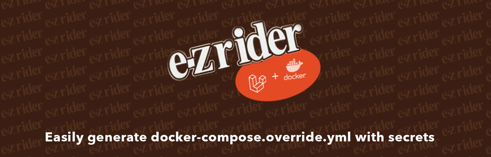

<p align="center"></p>

<p align="center">
  <a href="https://github.com/laravel-zero/framework/actions"></img></a>
  <a href="https://packagist.org/packages/laravel-zero/framework"></a>
  <a href="https://packagist.org/packages/laravel-zero/framework"></a>
  <a href="https://packagist.org/packages/laravel-zero/framework"></a>
</p>

<p>EzRider is a php-cli command (packaged as a PHAR) that provides an easy way to generate Docker Compose Override files for your applications.</p>
Many times your application may require secrets or other sensitive information, perhaps even randomly generated data. By including certain annotations in your Docker Compose files, Ez-Rider will fetch/generate this data, and write the proper override file automatically.  

<p>You can think of this as akin to Vault annotations in K8s/Helm, which was an inspiration for this package and its annotation syntax.</p>

<small>Created and maintained by [Nick Poulos](https://nickpoulos.info)</small>

-----

### Development

- Built using [Laravel Zero](https://laravel-zero.com) - a great little distro of Laravel for building and packaging PHP-CLI applications using our favorite PHP framework
- Includes Plugins for Vault, and some random data generators
- Plugins are easily created, please submit a PR!

------

## Quick Start

1. Install this package globally via Composer, NOT from within your project source

```bash
compose global require nickpoulos/ezrider
```

2. In your project's Docker Compose file, create a service containing an environment variable using the syntax below:

docker-compose.yml
```yaml
version: '3.3'

services:
  our-new-api:
    environment:
      APP_KEY: laravel:app-key
      RANDOM_ARRAY_ELEMENT: random:array(local, sand, prod)
      RANDOM_INT_BETWEEN: random:int(1,1000)
      RANDOM_STRING_OF_LENGTH: random:string(64)
      RSA_KEY_PAIR_PUBLIC: rsa:public(4096, passport)   # takes key length and "key-pair name" as arguments
      RSA_KEY_PAUR_PRIVATE: rsa:private(4096, passport) # takes key length and "key-pair name" as arguments      
      VAULT_SECRET: vault:secret/data/path/to/vault#value # these poths are identical to K8s/Nomad keys
```

3. In your project's root folder (or wherever docker-compose.yml is located), run: 

```bash
./ez-rider
```

This command will also take an optional config file argument. This is useful when multiple mappings or customized docker-compose.yml filenames are required.

The default config below will be used when no config file argument is given. 

4. The command will map the appropriate variables and generate your `docker-compose.overrides.yml` file.


5. The config file can be committed as part of source control with your repo, and contains a simple array of input/output mappings:

```json
{
    "map": [
        {
            "input": "docker-compose.yml",
            "output": "docker-compose.override.yml"
        }
    ]
}
```

- `map`: array of map objects that sets which docker-compose files to map, and their output filename.

## Vault Plugin
The HashiCorp Vault Plugin connects to Vault servers via API.   It requires a Vault Base Url and Token to operate.  

The plugin will prompt you for this info and is cached for subsequent calls. 

If you have either of the following environment vars set, the prompt is skipped and these values used. 

For example: 

```bash
export VAULT_URL=http://our-vault-server.vault.com
export VAULT_TOKEN=abc1234
```

See the annotation syntax in Step 2 above.

## Random Generator
The random generator provides a few ways to generate some random data in your Docker Compose file.  There are methods for random string, random integer, and random element from array.  

# Laravel App Key Generator
This plugin will generate a Base64 encoded Laravel Application Key.

# RSA Key/Pair Generator
This plugin generates an RSA key/pair, and is suitable for things like Laravel Passport keys and other use cases. 

You can choose to use the public or private key, as well as provide arguments for key length and a "label" for the key/value pair.  If you only have one key value pair in your env, the label argument is not needed.  Key length is also optional and will default to 4096.  

See the annotation syntax in Step 2 above.

## License

EzRider is an open-source software licensed under the MIT license.
